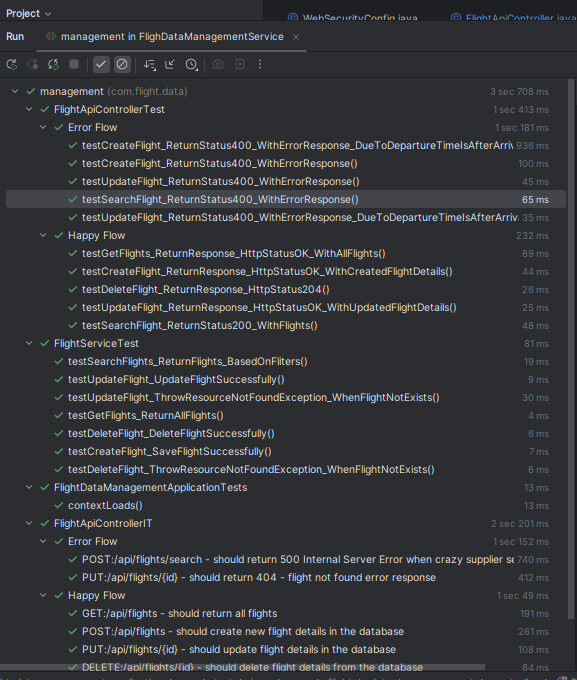
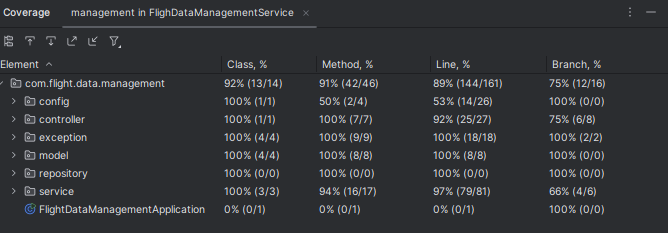

# Flight Data Management Application

This service will perform create, view, update, delete and search flights from the database. 
Additionally, in search flight API call will make call to Crazy Supplier api to fetch their flight information.

## Run Instruction

### Build and Test
    - Use 'mvc clean install' to build the application. This will run the unit and spring boot integration test during the build.

### Run application
    - Use 'java -jar .\flight-data-management-application-0.0.1.jar --spring.profiles.active=test' from the jar file location.

### Test API using Swagger UI
    - Use swagger to test the API's - http://localhost:8080/swagger-ui/index.html.

## Requirement assumptions:
* Search flights based on the departure airport, arrival airport, departure time and arrival time. Airline field is optional.

## Test results:

### Test cases:

### Code coverage result:
